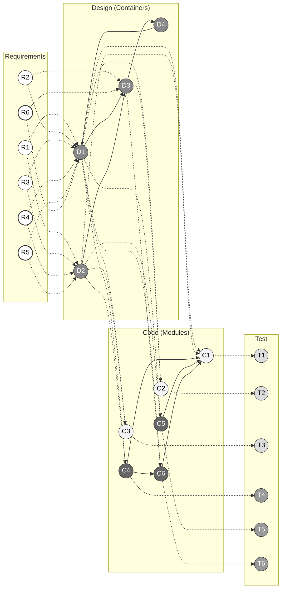
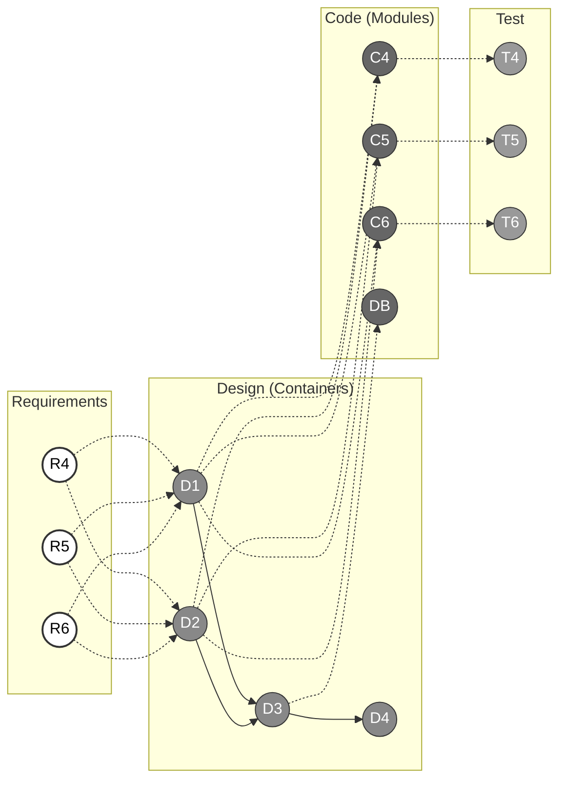
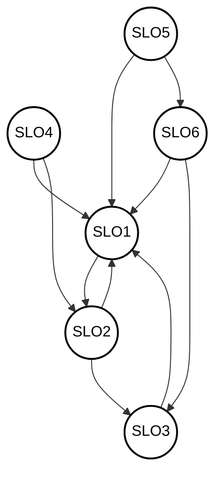

# SteamJek - Impact Analysis & Traceability Graph

## Full System Traceability Graph
This full traceability map outlines the relationships spanning from Software Requirements down to core Architectural Design (C4-inspired layout), specific Code Modules, and the corresponding Validation Testing suites. It includes our latest implementations.

> **Legend & Mapping:**
> - **Requirements:** R1 (Auth), R2 (Store), R3 (Cart), R4 (Community Hub), R5 (Point Shop), R6 (Item Marketplace)
> - **Design Containers:** D1 (Web Frontend), D2 (Mobile App), D3 (Express API), D4 (PostgreSQL)
> - **Code Modules:** C1 (authController), C2 (gamesController), C3 (cartController), C4 (communityController), C5 (pointShopController), C6 (marketController)
> - **Tests:** T1 (auth.test.js), T2 (games.test.js), T3 (cart.test.js), T4 (community.test.js), T5 (pointShop.test.js), T6 (market.test.js)

## Traceability Graph: Affected By Changes (D4)
The following isolated traceability graph matches the left-to-right visual style, but highlights **only the parts affected by the changes** in D4 (Point Shop, Community Features, and Marketplace).

## SLO Directed Graph (Code Modules)
Each core code module from the architecture represents a Software Lifecycle Object (SLO).
* **SLO1**: authController.js
* **SLO2**: gamesController.js
* **SLO3**: cartController.js
* **SLO4**: communityController.js (CR)
* **SLO5**: pointShopController.js (CR)
* **SLO6**: marketController.js (CR)

Here is the directed graph visualizing the dependencies between these SLOs:

## Connectivity Matrix with Distances
The distance representing the shortest directed path between two SLOs based on the graph above. 
If no path exists (the target is unreachable from the source), it is marked as `∞`.

| Source \ Target | SLO1 | SLO2 | SLO3 | SLO4 | SLO5 | SLO6 |
| :--- | :---: | :---: | :---: | :---: | :---: | :---: |
| **SLO1** | 0 | 1 | 2 | ∞ | ∞ | ∞ |
| **SLO2** | 1 | 0 | 1 | ∞ | ∞ | ∞ |
| **SLO3** | 1 | 2 | 0 | ∞ | ∞ | ∞ |
| **SLO4** | 1 | 1 | 2 | 0 | ∞ | ∞ |
| **SLO5** | 1 | 2 | 2 | ∞ | 0 | 1 |
| **SLO6** | 1 | 2 | 1 | ∞ | ∞ | 0 |

## Change Request Impact Evaluation

### 1. Which change requests are easy to apply and why?
**Point Shop:** This feature is relatively straightforward to apply. It functions as an isolated, standalone module extending the user profile. The business logic primarily involves a simple increment/decrement of a point balance after a user makes a purchase, and basic CRUD operations for unlocking standard cosmetics like frames and banners. It does not heavily interfere with existing core critical paths (like core authentication or external payment gateways), which minimizes the risk of breaking existing functionality (low regression risk).

### 2. Which change requests are difficult to apply and why?
**Item Marketplace Integration:** This is significantly difficult to implement because it introduces a complex dual-sided transactional system. It requires atomic database operations (ensuring ACID compliance) to guarantee users aren't duplicating items or manipulating virtual economies during race conditions. It also heavily couples with user inventories, point systems, and requires rigorous security validation against exploits.
**Community Forums:** This is moderately to highly difficult due to the sheer volume of relational data and state it introduces. It requires managing deeply nested data structures (Games -> Threads -> Replies -> Likes), tag-based search indexing, and ensuring database query performance remains optimal as user-generated content rapidly scales.

### 3. To make maintenance easier, what would you expect from the previous developers?
*   **Comprehensive Test Coverage:** A robust suite of unit and integration tests (especially around the core `cartController` and `purchasesController`) would provide a safety net to ensure that adding point-reward hooks doesn't accidentally break the main checkout flow.
*   **Loose Coupling / Event-Driven Architecture:** Instead of tightly binding controllers, an event-emitter pattern (e.g., dispatching a `GAME_PURCHASED` event) would allow new modules like the Point Shop to independently listen and react without modifying the core purchase code directly.
*   **Clear Documentation & Schema Diagrams:** Detailed, up-to-date Entity-Relationship (ER) diagrams and API contracts (like OpenAPI/Swagger) would significantly speed up the data-modeling phase for the new nested schemas required for the Community and Marketplace features.
*   **Modular UI Components:** The usage of clean, reusable frontend components instead of duplicated HTML/CSS blocks (which historically caused high SonarQube code smells) would make injecting new interfaces like forum boards and marketplace listings much faster and less error-prone.
